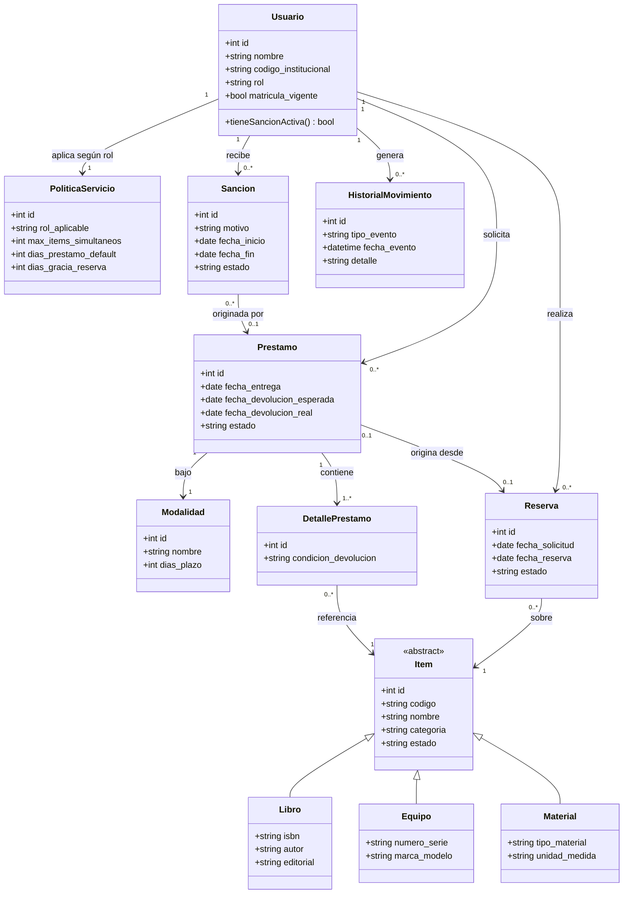

# Sistema de Préstamos — Escuela de Computación
## Análisis de Requisitos y Modelo de Dominio

**Curso:** Trabajo Interdisciplinar
**Stack tecnológico:** Python · Flask · SQLAlchemy (ORM) · PostgreSQL · Astro (frontend)

---

## 1. Introducción y alcance

El Sistema de Préstamos gestiona el préstamo de recursos (equipos, libros, materiales) de la escuela de computación a usuarios autorizados (estudiantes matriculados y personal perteneciente a la escuela: docentes, administrativos, auxiliares). Cubre todo el ciclo: catalogar el inventario, reservar, prestar, devolver, sancionar por incumplimiento y consultar historial.

**Supuestos declarados** (ajustar si el docente indica otra cosa):
- "Modalidades" = tipos de préstamo según lugar de uso (**In situ / Sala** vs. **Externo / Domicilio**), cada uno con reglas propias de plazo y elegibilidad.
- Las sanciones se generan automáticamente por retraso o daño, y bloquean nuevos préstamos mientras estén activas.
- Puede haber recursos de distinto tipo (libro, equipo, material) modelados bajo un inventario común con atributos específicos por tipo.
- Un usuario puede tener varios roles a la vez (ej. estudiante que además es auxiliar de laboratorio) — se modela como rol, no como subtipo excluyente.

---

## 2. Actores del sistema

| Actor | Descripción |
|---|---|
| **Estudiante matriculado** | Usuario con matrícula vigente en la escuela; puede reservar y solicitar préstamos según su política de perfil. |
| **Docente / Personal de la escuela** | Usuario perteneciente a planta docente/administrativa; suele tener políticas más flexibles (más ítems, más días). |
| **Bibliotecario / Encargado de inventario** | Administra el catálogo, registra altas/bajas de ítems, aprueba o rechaza reservas, entrega y recibe préstamos. |
| **Administrador del sistema** | Configura políticas del servicio, modalidades, tipos de sanción y parámetros globales; gestiona usuarios y roles. |
| **Sistema (automático)** | Genera sanciones por vencimiento, actualiza estados de inventario/reserva, envía notificaciones. |

---

## 3. Requisitos funcionales (RF)

**Gestión de usuarios**
- RF01: Registrar usuarios con datos personales, rol (estudiante/docente/administrativo) y estado de matrícula/vinculación.
- RF02: Verificar que el usuario esté habilitado (matrícula vigente, sin sanciones activas) antes de autorizar un préstamo o reserva.
- RF03: Asociar a cada usuario una política de servicio según su perfil (límite de ítems, días de préstamo, tipos de recurso permitidos).

**Gestión de inventario**
- RF04: Registrar ítems del inventario (libros, equipos, materiales) con atributos comunes (código, nombre, categoría, estado) y atributos específicos por tipo (ISBN/autor para libros; número de serie/marca-modelo para equipos).
- RF05: Actualizar el estado de un ítem (disponible, prestado, reservado, en mantenimiento, dado de baja, extraviado).
- RF06: Consultar disponibilidad de ítems por tipo, categoría o palabra clave.

**Reservas**
- RF07: Permitir que un usuario habilitado reserve un ítem disponible para una fecha/franja futura.
- RF08: Cancelar o expirar automáticamente una reserva no recogida dentro de un plazo definido por la política.
- RF09: Convertir una reserva confirmada en préstamo al momento de la entrega.

**Préstamos**
- RF10: Registrar un préstamo indicando usuario, ítem(es), modalidad (in situ / externo), fecha de entrega y fecha de devolución esperada (calculada según política).
- RF11: Registrar la devolución de un préstamo, actualizando el estado del ítem y verificando condición (daño, pérdida).
- RF12: Permitir renovación de un préstamo si no hay reservas pendientes sobre el ítem y el usuario no tiene sanciones.
- RF13: Bloquear nuevos préstamos a usuarios con sanciones activas o que excedan su límite de ítems simultáneos.

**Sanciones**
- RF14: Generar sanción automática cuando un préstamo se devuelve fuera de plazo, calculando su duración según reglas configurables (p. ej. días de sanción por día de atraso).
- RF15: Permitir registrar sanciones manuales (por daño o pérdida de un ítem) con motivo y duración/monto definidos por un administrador.
- RF16: Levantar (cerrar) una sanción al cumplirse su plazo o al resolverse (p. ej. pago o reposición del ítem).

**Historial y políticas**
- RF17: Mantener historial completo de préstamos, reservas y sanciones por usuario y por ítem, consultable por fecha o estado.
- RF18: Configurar políticas del servicio (límites por rol, duración de préstamo por modalidad, reglas de sanción) desde un módulo administrativo, sin requerir cambios de código.

---

## 4. Requisitos no funcionales (RNF)

- RNF01: Persistencia en PostgreSQL con integridad referencial garantizada por el ORM (SQLAlchemy) y restricciones a nivel de base de datos.
- RNF02: La API (Flask) debe exponer endpoints RESTful consumidos por el frontend en Astro, con separación clara backend/frontend.
- RNF03: Trazabilidad: cada cambio de estado relevante (préstamo, sanción, ítem) debe quedar registrado con fecha/hora y usuario responsable (auditoría mínima).
- RNF04: Disponibilidad de consulta de catálogo sin necesidad de autenticación; operaciones de préstamo/reserva sí requieren autenticación.
- RNF05: Tiempos de respuesta aceptables para consultas de catálogo (uso típico de laboratorio/biblioteca universitaria, no alta concurrencia masiva).
- RNF06: Extensibilidad: agregar un nuevo tipo de recurso (p. ej. "kits de robótica") no debe requerir rediseñar el modelo de inventario.

---

## 5. Reglas del negocio clave

1. Un usuario con al menos una sanción **activa** no puede generar nuevos préstamos ni reservas.
2. El plazo de devolución se calcula a partir de la **modalidad** del préstamo y la **política** asociada al rol del usuario.
3. Un ítem solo puede estar en un préstamo activo a la vez; su estado debe reflejarlo (`disponible` → `prestado`).
4. Una reserva vencida sin ser recogida libera el ítem automáticamente.
5. La renovación de un préstamo no procede si existe una reserva pendiente sobre el mismo ítem.
6. Toda sanción registra su origen (retraso, daño, pérdida) y su estado (activa/cerrada).

---

## 6. Modelo de dominio

### 6.1 Entidades principales y responsabilidades

| Entidad | Responsabilidad |
|---|---|
| **Usuario** | Identidad y rol de quien interactúa con el sistema. |
| **PoliticaServicio** | Reglas que rigen a un rol de usuario (límites, plazos). |
| **Item** (superclase) | Recurso prestable; se especializa en `Libro`, `Equipo`, `Material`. |
| **Modalidad** | Forma en que se realiza el préstamo (in situ / externo) y su regla de plazo. |
| **Reserva** | Intención de préstamo futuro sobre un ítem. |
| **Prestamo** | Transacción activa/cerrada de entrega y devolución de uno o más ítems. |
| **DetallePrestamo** | Relación entre un préstamo y cada ítem incluido (permite préstamos multi-ítem). |
| **Sancion** | Restricción temporal sobre un usuario, con motivo y vigencia. |
| **HistorialMovimiento** | Registro auditable de cambios de estado (préstamo, reserva, sanción, ítem). |

### 6.2 Diagrama de clases (Mermaid)

### 6.3 Notas sobre el modelo

- **Item como jerarquía**: se recomienda **herencia de tabla única o joined-table inheritance en SQLAlchemy** (`polymorphic_identity`) para `Libro`, `Equipo`, `Material` — así el inventario es uno solo, pero cada tipo conserva sus atributos propios.
- **DetallePrestamo** existe para soportar préstamos de múltiples ítems en una sola transacción sin duplicar lógica de fechas/estado en `Prestamo`.
- **Sancion** se vincula opcionalmente a un `Prestamo` (para las automáticas por retraso) pero puede existir sin préstamo asociado (para pérdidas o daños reportados aparte).
- **HistorialMovimiento** actúa como bitácora transversal: cualquier entidad relevante (préstamo, reserva, sanción, ítem) puede generar un evento, cubriendo RF17 y RNF03 sin necesidad de tablas de auditoría separadas por entidad.
- **PoliticaServicio** desacopla las reglas de negocio (límites, plazos) del código, cumpliendo RF18: cambiar un límite es una actualización de datos, no de lógica.

---

## 7. Próximos pasos sugeridos

1. Validar este análisis con el docente/equipo antes de pasar a diagramas de casos de uso detallados o diagrama entidad-relación físico.
2. A partir de este modelo de dominio, derivar el esquema de tablas PostgreSQL y los modelos SQLAlchemy (`Base`, mixins de auditoría, `relationship()`).
3. Definir los endpoints Flask (REST) que consumirá el frontend Astro, agrupados por recurso: `/usuarios`, `/items`, `/reservas`, `/prestamos`, `/sanciones`.
