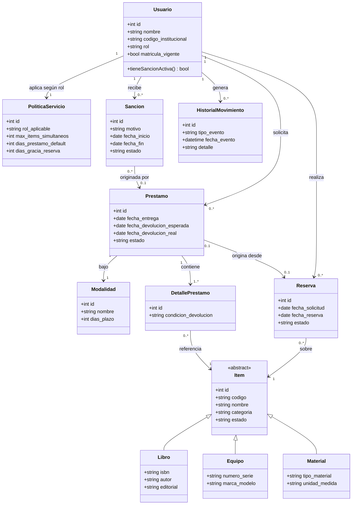

# Documento de Análisis de Requisitos y Modelo de Dominio
**Proyecto:** Sistema de Gestión de Préstamos para la Escuela Profesional de Ciencia de la Computación  
**Asignatura:** Trabajo Interdisciplinar  
**Stack Tecnológico:** Python · Flask · SQLAlchemy (ORM) · PostgreSQL · Astro (Frontend)  

---

## 1. Introducción y Alcance del Proyecto

El presente proyecto nace como una solución integral para organizar y automatizar el control de préstamos de recursos dentro de la Escuela Profesional de Ciencia de la Computación. Actualmente, la escuela maneja diversos tipos de bienes (equipos de laboratorio, visores de realidad virtual, libros especializados y accesorios diversos) que son requeridos tanto por estudiantes como por docentes.

El objetivo general del sistema es gestionar todo el ciclo de vida del préstamo: desde la publicación y reserva de un ítem hasta su entrega física, devolución, control de fechas de vencimiento, aplicación de sanciones en caso de faltas, y el registro de un historial completo de movimientos para auditoría.

### Supuestos Iniciales del Análisis
Para delimitar el alcance técnico del sistema, hemos asumido los siguientes criterios de diseño:
* **Clasificación por Modalidad:** Un recurso puede prestarse bajo dos modalidades principales:
  * *In situ (Uso en laboratorio/sala):* Préstamos por horas dentro del mismo pabellón.
  * *Uso Externo (Domicilio):* Préstamos por días con fechas límites bien definidas.
* **Control Automatizado de Sanciones:** Cuando un usuario incurre en un retraso en la devolución o reporta un bien con daño/pérdida, el sistema bloquea automáticamente su capacidad de realizar nuevas reservas o préstamos hasta que la falta sea resuelta.
* **Políticas Flexibles por Perfil:** Las reglas del servicio no son fijas. Un docente o personal de la escuela puede tener un límite mayor de ítems prestados o plazos más extendidos en comparación con un estudiante.
* **Modelado Único de Inventario:** Aunque un libro y un multímetro tienen características muy distintas, ambos comparten un catálogo base de inventario, especializándose en atributos propios según su categoría.

---

## 2. Participantes / Actores del Sistema

Para el diseño se identificaron cuatro roles o actores clave que interactúan con la plataforma:

1. **Estudiantes Matriculados:** Alumnos pertenecientes a la escuela con matrícula vigente. Pueden explorar el catálogo, realizar reservas previas y solicitar préstamos respetando los límites de su perfil.
2. **Docentes y Personal Académico:** Pertenecen a la planta docente o administrativa. Disponen de permisos extendidos en plazos y cantidad de materiales debido a labores de investigación o docencia.
3. **Encargado de Inventario / Bibliotecario:** Operador del sistema. Se encarga de dar de alta o baja los recursos, registrar entregas físicas, procesar devoluciones y verificar la condición de los materiales devueltos.
4. **Administrador del Sistema:** Rol con acceso total para configurar las políticas globales (días permitidos, reglas de sanciones), administrar cuentas de usuarios y gestionar parámetros del sistema.

---

## 3. Requisitos Funcionales

Hemos agrupado las funcionalidades requeridas en módulos lógicos para facilitar su desarrollo:

### A. Módulo de Usuarios y Políticas
* **Registro y Verificación:** El sistema debe registrar usuarios vinculados a la escuela verificando su condición de matriculado o activo.
* **Validación de Habilitación:** Antes de autorizar cualquier reserva o préstamo, el sistema debe comprobar que el usuario no tenga sanciones activas o sobrepase su límite de ítems simultáneos.
* **Reglas por Perfil:** Debe ser posible parametrizar límites máximos (ej. máximo 3 libros para estudiantes, máximo 5 para docentes) y días de vigencia según el rol del usuario.

### B. Módulo de Inventario Unificado
* **Gestión de Ítems y Categorías:** Registro de equipos, libros y materiales con datos comunes (código interno, nombre, estado, categoría).
* **Atributos Específicos:**
  * *Libros:* ISBN, autor, editorial, edición.
  * *Equipos:* Número de serie, marca, modelo, especificaciones técnicas.
  * *Materiales/Accesorios:* Categoría del material y unidad de medida, cuando corresponda.
* **Control de Estados:** Cada ítem mantendrá un estado actualizado en tiempo real (`Disponible`, `Prestado`, `Reservado`, `En Mantenimiento`, `Dado de Baja`).

### C. Módulo de Reservas y Préstamos
* **Gestión de Reservas:** Permite a un usuario apartar un recurso disponible para una fecha concreta. Si el usuario no recoge el ítem dentro del margen establecido por política, la reserva expira automáticamente.
* **Registro del Préstamo:** Al momento de la entrega, se genera la transacción indicando la modalidad (*In situ* o *Externo*), calculando la fecha límite de devolución. Un solo préstamo puede incluir uno o más ítems.
* **Devolución y Renovación:** Se registra el reingreso del recurso, evaluando su estado de conservación. La renovación de fecha solo será permitida si el recurso no cuenta con reservas pendientes de otros usuarios.

### D. Módulo de Sanciones e Historial
* **Sanciones Automáticas y Manuales:** Generación automática de días de suspensión si se entrega un recurso con días de retraso. Registro manual de sanciones aplicadas por el encargado en caso de daños físicos o pérdida.
* **Trazabilidad de Movimientos:** Registro de una bitácora o historial donde se visualice cada cambio de estado, fecha, usuario involucrado y observaciones del préstamo.

---

## 4. Requisitos No Funcionales y Criterios Arquitectónicos

Para alinearnos al stack técnico solicitado, consideramos las siguientes pautas de diseño:

* **Persistencia y Modelo de Datos (PostgreSQL + SQLAlchemy):** La base de datos estará estructurada en PostgreSQL. Utilizaremos el ORM SQLAlchemy en Python para gestionar las migraciones, la integridad referencial y mapear las clases del dominio hacia las tablas relacionales.
* **Arquitectura Desacoplada (Backend Flask / Frontend Astro):**
  * **Backend (Flask):** Expondrá una API RESTful encargada de la lógica del negocio, validación de reglas, autenticación y transacciones con la base de datos.
  * **Frontend (Astro):** Proporcionará una interfaz web moderna, rápida e interactiva que consumirá los endpoints JSON expuestos por el backend.
* **Consistencia e Historial:** Para garantizar auditoría técnica, las operaciones críticas no borrarán registros físicamente, sino que actualizarán sus estados y crearán entradas en una tabla de auditoría/historial.

---

## 5. Reglas de Negocio Esenciales

1. **Bloqueo por Sanción:** Ningún usuario con al menos una sanción vigente podrá reservar ni solicitar nuevos préstamos.
2. **Prioridad de Reservas:** No se puede renovar un préstamo si existe un pedido de reserva en cola para ese mismo ítem.
3. **Exclusividad del Ítem:** Un ítem no puede figurar en dos préstamos activos al mismo tiempo; su estado pasa a `Prestado` en cuanto se concreta la entrega.
4. **Expiración de Reservas:** Las reservas tienen un tiempo de tolerancia programado. Pasado ese lapso, el sistema libera el bien al estado `Disponible`.

---

## 6. Modelo de Dominio

### 6.1 Descripción de Entidades

* **Usuario:** Modela a la persona (estudiante o trabajador de la escuela).
* **PoliticaServicio:** Almacena los parámetros y reglas de negocio asociadas a cada rol (máximo de préstamos, días de margen).
* **Item (Clase Base / Superclase):** Representa el concepto abstracto de cualquier recurso físico prestable. Se especializa en:
  * **Libro**
  * **Equipo**
  * **Material**
* **Modalidad:** Define el tipo de préstamo (*Uso en Sala* o *Uso Domiciliario*).
* **Reserva:** Registro previo a la entrega física.
* **Prestamo:** Encabezado de la transacción de salida de recursos.
* **DetallePrestamo:** Permite asociar múltiples ítems a un solo préstamo y registrar la condición de retorno individual de cada ítem.
* **Sancion:** Registro del castigo o inhabilitación temporal aplicada a un usuario.
* **HistorialMovimiento:** Bitácora general para registrar eventos del sistema (altas, préstamos, devoluciones, sanciones).

---

### 6.2 Diagrama de Clases (Estructura del Dominio)

---

### 6.3 Estrategia de Implementación Técnica en SQLAlchemy

1. **Herencia en el Inventario (`Polymorphic Identity`):**
   Para implementar los tipos de `Item` (`Libro`, `Equipo`, `Material`) en SQLAlchemy, se utilizará una estrategia de herencia por tabla única (*Single Table Inheritance*) o tablas unidas (*Joined Table Inheritance*). Esto permitirá consultar todo el catálogo ejecutando consultas sobre la tabla base `Item`, reteniendo al mismo tiempo las propiedades específicas de cada subtipo.

2. **Detalle del Préstamo:**
   La entidad `DetallePrestamo` actúa como tabla intermedia entre `Prestamo` e `Item`. Esto evita duplicar la fecha general del préstamo y permite evaluar la condición física en la que se devuelve individualmente cada componente entregado.

3. **Flexibilidad en Sanciones:**
   La relación entre `Sancion` y `Prestamo` es opcional (`0..1`). Esto se debe a que una sanción puede provenir automáticamente de un retraso registrado en un préstamo, o bien crearse de manera independiente si un usuario dañó o extravió un equipo fuera del flujo estándar.
